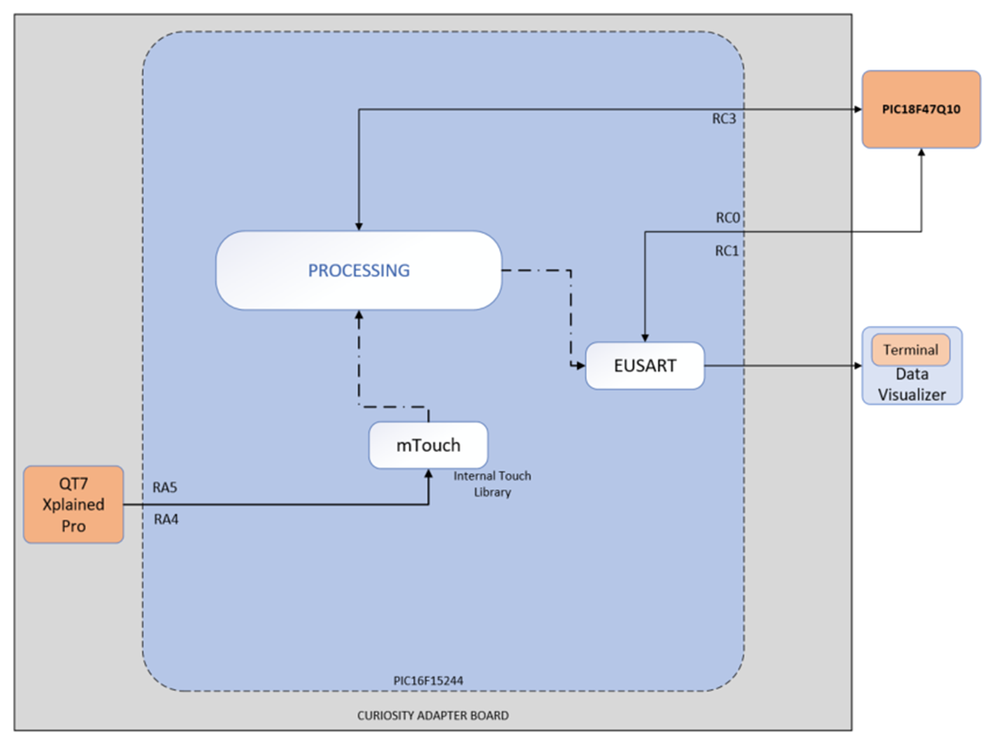

<!-- Please do not change this logo with link -->

# Sleep Wake-Up Touch Button: Host Emulation using PIC18F47Q10 Microcontroller

## Introduction

The modern electronic devices have been equipped with intuitive capacitive touch interface for the users to interact with and operate these devices, as the touch interface is durable, flexible to design, aesthetically appealing and offers a pleasurable experience to the users. For example; the white goods that is home appliances such as cooktops, coffee makers, washing machines, tumble driers, dishwashers, refrigerators, freezers, microwave ovens, and water purifiers etc. These devices are designed in such a way that they go into standby mode when the device is not used for some time. Thereby, average power consumption of the device will be minimum. Such devices require sleep wake-up functionality to bring the device into active mode whenever a user activity is reported on it. These devices also require periodic self-test mechanism for verifying the tasks such as proper functioning of the system, working of various sensors interfaced to it, keep tracking of inventory availability, etc. depending on the type of device.

Refer code example [Sleep Wake Up Touch Button Implementation using PIC16F15244 Microcontroller](https://github.com/microchip-pic-avr-examples/pic16f15244-cnano-sleep-wakeup-touch-button-client-mplab-mcc.git) for more details about the client device implementation.

This code example demonstrates usage of PIC16F15244 microcontroller as client device in a system where it generates a trigger pulse through GPIO to wake-up the host microcontroller from sleep. Also, the code example has got provision to dynamically configure the system sleep period through UART interface. The client device generates trigger pulse either to a valid finger touch event on the configured touch button or to wake-up the host microcontroller from sleep when sleep period is elapsed.

  
   Figure 1: System Block Diagram 

## Useful Links

- [PIC16F15244 Product Page](https://www.microchip.com/wwwproducts/en/PIC16F15244 "PIC16F15244 Product Page")
- [PIC16F15244 Code Examples on GitHub](https://github.com/microchip-pic-avr-examples "PIC16F15244 Code Examples on GitHub")
- [PIC16F152xx MCU Family Video](https://youtu.be/nHLv3Th-o-s)
- [PIC16F152xx MCU Product Family Page](https://www.microchip.com/en-us/products/microcontrollers-and-microprocessors/8-bit-mcus/pic-mcus/pic16f15244 "PIC16F15244 Product Family Page")

## Description

In this code example, the PIC16F15244 microcontroller act as a client and is interfaced with QT7 Xplained Pro extension kit to facilitate capacitive touch button sensor required in the application. The mTouch™ library running on PIC16F15244 microcontroller enable the capacitive touch button feature implementation. The PIC18F47Q10 microcontroller will act as host and communicates with the client over UART interface.

Before entering sleep, the host device sends sleep period details to the client over the UART interface. So, the client device monitors sleep duration and provides a trigger pulse through GPIO to wake-up the host from sleep when sleep period is elapsed. Upon wake-up from sleep, the host device blinks on-board LED, performs intended activities, and then enters sleep after inactivity period is triggered.

The mTouch™ library running on client microcontroller periodically scan the configured touch button. If there is no activity on the touch button, the client goes to sleep. If a valid touch event is reported on the touch button, the client generates a trigger pulse to host device through a GPIO and then goes to sleep. Additionally, client monitors sleep duration of the host device, if it receives the sleep period details from the host over UART interface. It generates a trigger pulse once the sleep period is elapsed and wakes-up the host from sleep.

## Software  Tools

* MPLAB® X IDE [v6.0.0 or newer](https://www.microchip.com/mplab/mplab-x-ide)
* XC8 Compiler [v2.36.0 or newer](https://www.microchip.com/mplab/compilers)
* Microchip PIC18F-Q Series Device Support Pack [v1.13.211 or newer](https://packs.download.microchip.com/#collapse-Microchip-PIC18F-Q-DFP-pdsc)
* Microchip PIC16F1xxxx Series Device Support Pack [v1.13.178 or newer](https://packs.download.microchip.com/Microchip.PIC16F1xxxx_DFP.1.8.149.atpack)
* Microchip Code Configurator [v5.1.1 or newer](https://www.microchip.com/mplab/mplab-code-configurator)
* mTouch Capacitive Sensing Library 2.91.0

***Note: For running the demo, the installed tool versions should be the same or later. This example is not tested with the previous versions.***

## Hardware Used

* [PIC16F15244 Curiosity Nano](https://www.microchip.com/en-us/product/PIC16F15244)
* [PIC18F47Q10 Curiosity Nano](https://www.microchip.com/Developmenttools/ProductDetails/DM182029)
* [Curiosity Nano Base for Click boards](https://www.microchip.com/developmenttools/ProductDetails/AC164162)
* [Curiosity Nano Touch Adapter Board](https://www.microchip.com/en-us/development-tool/AC80T88A)
* [QT7 Xplained Pro Extension Board](https://www.microchip.com/en-us/development-tool/ATQT7-XPRO)

## Application Firmware

This example is supplemented with two standalone firmware named as host firmware, client firmware.

The host firmware communicates with the client firmware using EUSART and informs the sleep duration (15seconds is considered here for demo purpose). After confirming if the transmission is completed, it enters Sleep mode. As and when the host device receives the wake up pulse from client, it wakes-up from the sleep mode, performs the activities and again enters sleep mode.

The client firmware used timer 1 for scanning touch button, periodic reset, and active period flags. It is mainly divided into three sections. First section comprises of periodically scanning capacitive touch button using mTouch™ library for detecting valid finger touch events reported on it. In the second section, the client generates a trigger pulse (to host device) to a valid finger touch event for waking it up from sleep. Last section consists of monitoring sleep period of the host that is received from host through UART interface received via EUSART from the host device. It sets up the periodic reset flag and monitors it for the specified duration. As and when the time is elapsed, it sends the wake-up signal to the host device.

## Hardware Setup

The PIC16F15244 Curiosity Nano evaluation kit along with PIC18F47Q10 curiosity nano evaluation kit, QT7 Xplained pro extension kit, Curiosity touch adapter board, and Curiosity nano base for Click boards is used to setup client and host devices. The following figure shows hardware setup of the application and interconnections between the host and client boards. Refer hardware connection details table for more information.

  
   Figure 2: Hardware Setup  

## Hardware Connections

Host MCU connection details are mentioned below:

|Sr. No| MCU Pin #|Signal Name|Signal Description |IN/OUT|  
|:---------:|:----------:|:----------:|:----------:|:----------:|
| 1 | RA6 | GPIO | Pulse Signal I/P (Interrupt) | OUT |
| 2 | RD0 | EUSART | Transmit| OUT |
| 3 | RD1 | EUSART | Receive | IN |
| 4 | RE0 | GPIO | LED on PIC18F47Q10 Curiosity Nano board | OUT |

Client MCU connection details are mentioned below:

|Sr. No| MCU Pin #|Signal Name|Signal Description |IN/OUT|  
|:---------:|:----------:|:----------:|:----------:|:----------:|
| 1 | RA2 | GPIO | LED on PIC16F15244 Curiosity Nano board | OUT |
| 2 | RA4 | GPIO | Touch Button | IN |
| 3 | RA5 | GPIO | QT7 LED | OUT |
| 4 | RC0 | EUSART | Transmit | OUT |
| 5 | RC1 | EUSART | Receive | IN |
| 6 | RC3 | GPIO| Pulse Signal O/P to host| OUT |

The host Tx-Rx Pins connected to Client Rx-Tx pins, along with the pulse signal input output pins respectively.

|Sr. No| MCU Client Pin |MCU Host Pin | 
|:---------:|:----------:|:----------:|
| 1 | RC0 (Tx) | RD1 (Rx)| EUSART |
| 2 | RC1 (Rx) | RD0 (Tx) | EUSART |
| 3 | RC3 | RA6 | Interrupt |

## Demo Operation

* Connect the hardware as shown in the Hardware Setup section . Power up the host and client boards using micro USB cable. 
* Load the host application firmware to the PIC18F47Q10 Curiosity Nano board which is connected to the client device through EUSART and GPIO interface.
* Load the client application firmware to the PIC16F15244 Curiosity Nano board interfaced with the QT7 Xplained Pro.
* On powering on, host MCU sends the periodic reset time to the client device over UART and enters the sleep mode.
* If the periodic wake-up period is elapsed, then client sends a wake-up signal to the host device.
* In addition to it, the client checks for user touch, if touch is detected sends the wake-up pulse to the host device and enters sleep mode.

## Conclusion

Many electronic devices require a button to put them into active state either from standby or sleep mode. Also, these devices require a periodic wake-up event for performing periodic self-test and other activities depending on the type of device. This code example demonstrates how the above activities can be off-loaded by the host Microcontroller to PIC16F15244 microcontroller based client and lower power consumption can be achieved.

## Appendix

This section shows the settings used for the system clock and the peripheral configurations in the demo example. These settings were done using the MPLAB Code Configurator (MCC). Open MCC to look at the settings of the modules.

## MCC Settings:

In this demo firmware, the High-Frequency Internal Oscillator (HFINTOSC) is configured to generate 16MHz clock and is used as a system clock. Refer figure 1.

System Configuration:

  
   Figure 3: System Clock Configuration - Host  

  
   Figure 4: System Clock Configuration - Client  

EUSART Configuration:

  
   Figure 5: EUSART Configuration - Host  

  
   Figure 6: EUSART Configuration - Client  

mTouch™ Configuration:

  
   Figure 7: mTouch™ Configuration - Button Settings  

  
   Figure 8: mTouch™ Configuration - Sensor Settings  

Timer2 Configuration:

Timer2 is required for the ATQT7-XPRO scanning as well as for the waking it up after fixed duration. The configuration for the same are given below:

  
   Figure 9: Timer2 Configuration  

## Pin Configuration

  
   Figure 10: Pin Configuration - Host  

  
   Figure 11: Pin Configuration - Client  

